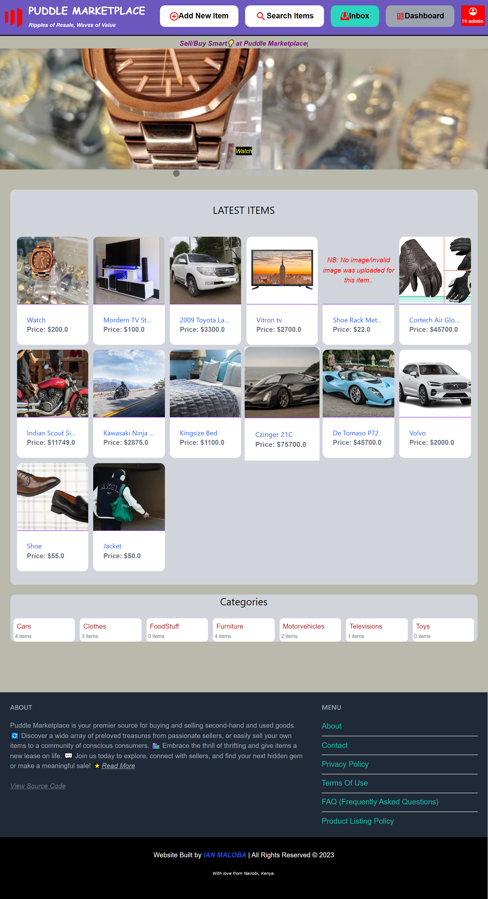

# Puddle Marketplace
https://www.puddlemarketplace.co.ke/

## Introduction
A simple online platform designed for buying and selling used or second-hand items. Built with Python, Django, Tailwind CSS, JavaScript and HTML.


## Installation

1. Clone the repository:
    ```
    git clone https://github.com/IanMalobaMwakha/Puddle.git
    ```

2. Navigate to the project directory.

3. Create a virtual environment:
    - For Windows:
        ```
        python -m venv venv
        venv\Scripts\activate.bat
        ```
    - For Unix or MacOS:
        ```
        python -m venv venv
        source venv/bin/activate
        ```

4. Update pip:
    ```
    python -m pip install --upgrade pip
    ```

5. Install dependencies:
    ```
    pip install -r requirements.txt
    ```



## Apps

### Core
- The Core app provides a consistent layout across the website.
- It includes a fixed navbar, dynamic buttons based on user authentication, a footer with essential links, and navigation elements.
- Features like scroll-to-top and previous page button enhance user experience.
- The index page showcases latest items and incorporates advertisements.

### Profile
- The Profile app allows users to personalize their profiles.
- Users can add avatars, locations, and bios, with options to delete their profiles.
- Login and Logout functionalities are integrated.

### Dashboard
- The Dashboard app offers a space for users to manage their listed items.
- It displays all items owned by the logged-in user.

### Items
- The Items app hosts item-related models and detail page layout.
- The detail page showcases item information, images (with enlarging), seller details, and related items.

### Conversation
- The Conversation app facilitates communication between users.
- Users can access their conversations through the inbox and engage in discussions with rich-text messaging.

## Tools, Frameworks, and Technologies Used
- **Python:** Backend logic and scripting.
- **Django:** Web framework handling routing, authentication, and database interactions.
- **Tailwind CSS:** User-friendly CSS framework aiding in consistent and responsive design.
- **JavaScript:** Dynamic behavior for UI elements.
- **HTML:** Markup language for website structure.
- **Git & GitHub:** Version control system and collaborative platform for tracking and sharing code changes.


## Usage

1. Navigate to the project directory.

2. Start the development server:
    ```
    python manage.py runserver
    ```

3. Access the application in your web browser at the provided URL.

## License

This project is licensed under ......

## Acknowledgements

- Special thanks to the contributors of all the libraries and frameworks used in this project.
- Icons made by [Iconify](https://github.com/iconify/iconify) from [www.iconify.design](https://iconify.design/).


**Note:**
This README is subject to updates, as the repository is still under development and testing. Some issues may still need to be resolved.
